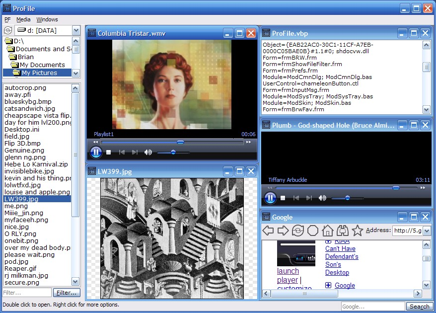



## A 60\-kB multimedia Viewer

### Description

Project covers the following: photo ZOOMs with respect to ASPECT RATIO, opens JPG BMP or GIF with CHECKERED BACKGROUND. WEB BROWSER also can open multiple PAGES with POPUP BLOCKER as well as IE FAVORITES access. The MEDIA CONTROL plays anything your media player plays with option to STRETCH VIDEO, PLAY ON STARTUP, SYNC WITH MSN MESSENGER and HIDE CONTROLS. OPEN and SAVE TEXT files with the option to RUN TEXT AS CODE or LAUNCH TEXT AS URL, so you select some words and treat that as a file name. OPEN FROM URL from any control. SKIN MODULE allows you to skin a form without additional commands, just a SKIN.INI anywhere defined. FILTERING of files viewing. CUSTOM MESSAGE BOX with a feature called DO NOT SHOW AGAIN, which allows the user to stop getting annoyed at the program. This program asks the user HOW TO OPEN A FILE with it's dialog, and you can choose from many options. OLEDRAGDROP and COMMAND LAUNCH functions allow this program to open files from any location, for example if you drop some files onto the program icon, the program opens the file. If you open the program then drop multiple files into the interface then those files open too. You can even SHELL EXECUTE the files if this program cannot handle it itself. SANDBOX MODE protects the program INI FILE. You can use this program to COPY, MOVE, RENAME, MOVE TO RECYCLE BIN or DELETE a file. And believe it or not, to use all those features, it's only 59kb when compiled. To use ADVANCED FEATURES like EQUATION CALCULATOR, FTP CLIENT, SLIDESHOW MAKER, SCRIPTING ENGINE and FULL SCREEN BROWSER, you can download those optional RUN-TIME ADDINS at http://thinc.no-ip.info to enhance this program's features. The program runs as usual without those additional components.
 
### More Info
 
Bug on frmPrefs fixed; the compiled size is 1kb less now...

             |
---                |---
**Submitted On**   |2007-04-01 22:19:10
**By**             |[Brian Lai](https://github.com/Planet-Source-Code/PSCIndex/blob/master/ByAuthor/brian-lai.md)
**Level**          |Intermediate
**User Rating**    |4.6 (23 globes from 5 users)
**Compatibility**  |VB 6\.0
**Category**       |[Complete Applications](https://github.com/Planet-Source-Code/PSCIndex/blob/master/ByCategory/complete-applications__1-27.md)
**World**          |[Visual Basic](https://github.com/Planet-Source-Code/PSCIndex/blob/master/ByWorld/visual-basic.md)
**Archive File**   |[A\_60\-kB\_mu205772422007\.zip](https://github.com/Planet-Source-Code/brian-lai-a-60-kb-multimedia-viewer__1-68166/archive/master.zip)

### API Declarations

See Code

